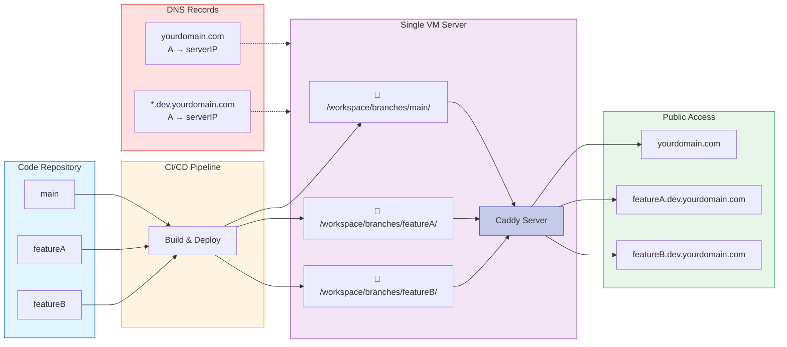

# Vercel-like development setup for Django using Caddy


Vercel provides sites like `{branch}.vercel.app` that show a preview of your changes and it usually builds really fast, which makes it a seamless experience.

This post gets you the same for Django (or any ASGI/WSGI app) on a single VM with Caddy, Python and rsync.

On each push, package the commit as a `.tar.gz` and rsync it to `/workspace/branches/{branchName}`.

The VM runs [Caddy](https://caddyserver.com/) with [caddy-snake](https://github.com/mliezun/caddy-snake). Which means you get automatic HTTPS, support for Websockets and fast static files serving.

Your production app runs on `yourdomain.com`.

Branches get a subdomain like `feature-x.dev.yourdomain.com`.

## Overview



- **CI/CD**: On each push, build a `.tar.gz` and rsync to `/workspace/branches/$BRANCH/`.
- **VM**: Caddy + caddy-snake. Production at `yourdomain.com`, previews at `*.dev.yourdomain.com`.
- **DNS**: A records for `yourdomain.com` and `*.dev.yourdomain.com` → VM IP.
- **Caddy**: Single configuration file and automatic HTTPS.

## 1. Deploy pattern: tar.gz + rsync

On every push (e.g. in GitHub Actions or GitLab CI), do something like:

```bash
# Example: in CI, after checkout
BRANCH_NAME="${GITHUB_REF#refs/heads/}"
tar -czf app.tar.gz \
  --exclude='.git' \
  --exclude='__pycache__' \
  --exclude='.venv' \
  .
rsync -avz --delete app.tar.gz \
  deploy@YOUR_VM_IP:/workspace/branches/"$BRANCH_NAME"/
ssh deploy@YOUR_VM_IP "cd /workspace/branches/$BRANCH_NAME \
  && tar -xzf app.tar.gz \
  && rm app.tar.gz \
  && uv sync \
  && uv run manage.py migrate \
  && uv run manage.py collectstatic --noinput"
```

Sanitize branch names in CI if needed (e.g. replace `/` with `-`) so the path and subdomain match.

The server can create the venv per branch with `uv sync` (as in the example) or you can ship a pre-built `.venv`.

## 2. Caddy + caddy-snake

Install Caddy with the [caddy-snake](https://github.com/mliezun/caddy-snake) plugin (see repo for build steps; [releases](https://github.com/mliezun/caddy-snake/releases) often include a binary).

### Example Caddyfile

- **Production**: `yourdomain.com` → fixed `working_dir` for `main`.
- **Previews**: `*.dev.yourdomain.com` → `working_dir` uses the placeholder; `autoreload` so the next request after a push serves the new code.

```Caddyfile
yourdomain.com {
  handle_path /static/* {
    root * /workspace/branches/main/staticfiles
    file_server
  }
  handle {
    python {
      module_wsgi app:wsgi.application
      working_dir /workspace/branches/main/
      venv .venv
    }
  }
}

*.dev.yourdomain.com {
  handle_path /static/* {
    root * /workspace/branches/{http.request.host.labels.3}/staticfiles
    file_server
  }
  handle {
    python {
      module_wsgi app:wsgi.application
      working_dir /workspace/branches/{http.request.host.labels.3}/
      venv .venv
      workers_runtime thread
      autoreload
    }
  }
}
```

Notes:

- `workers_runtime thread` is required with placeholders and `autoreload`.
- Use your Django WSGI path (e.g. `mysite.wsgi:application`) instead of `app:wsgi.application`.
- The branch directory must exist before the first request (CI creates it). Caddy-snake loads and caches the app on first request; `autoreload` watches for `.py` changes after each deploy.
- Set Django’s `STATIC_ROOT` to `staticfiles` so `collectstatic` matches the `staticfiles/` paths in the Caddyfile.

### Subdomain → branch name

Caddy splits the host into labels, **right to left**: for `featureA.dev.yourdomain.com`, `labels.0` = `com`, `labels.1` = `yourdomain`, `labels.2` = `dev`, `labels.3` = `featureA`. So the branch is `{http.request.host.labels.3}` for `*.dev.yourdomain.com`.

Adjust the index if your dev domain has a different structure.

## 3. DNS configuration

Add an "A record" for `@.dev.yourdomain.com` (use wildcard depending on your DNS provider) pointing to the VM’s IP.

After propagation, Caddy can obtain a cert for `*.dev.yourdomain.com` via ACME and route each subdomain to the matching branch directory.


## 4. What happens at runtime

- **First request** to `feature-x.dev.yourdomain.com`: Caddy resolves the placeholder to `/workspace/branches/feature-x/`; caddy-snake loads and caches the app. If that directory doesn’t exist yet (branch not deployed), the request fails until CI has run.
- **After a push**: CI overwrites the branch directory; the next request triggers `autoreload` and serves the new code.
- **New branch**: Push → CI creates the directory → first request to `new-branch.dev.yourdomain.com` loads it.

Push a branch, wait for CI, then open `{branch}.dev.yourdomain.com`.

## Bonus: clean up on merge

When a branch is merged and deleted, trigger a pipeline step that removes its directory on the VM (e.g. `ssh deploy@VM "rm -rf /workspace/branches/$BRANCH_NAME"`). Caddy-snake sees the directory is gone and stops serving that app; the next request to `{branch}.dev.yourdomain.com` fails until a new branch with that name is deployed. That keeps preview URLs only for active branches and frees disk space.
